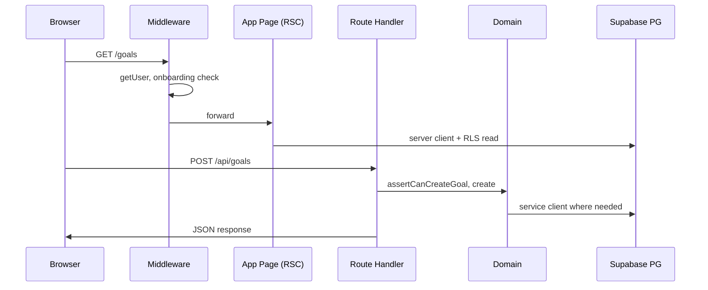

# Technical Architecture Map — Lifera

Карта технической архитектуры после Stage 1 (Architecture & Product Flow Lock). Детали схемы БД — в `DATABASE_SCHEMA.md`, исторический обзор — в `TECHNICAL_ARCHITECTURE.md`.

## Stack overview

| Layer | Technology |
| --- | --- |
| Frontend | Next.js 16 App Router, React 19, TypeScript, Tailwind CSS 4 |
| API | Next.js Route Handlers (`src/app/api/**`) |
| Database | Supabase PostgreSQL |
| Auth | Supabase Auth (email/password) |
| Deployment | Vercel |

## Frontend layer

```text
src/app/
  (public)/     — landing, auth, pricing, legal
  (app)/        — protected app pages (dashboard, goals, challenges, …)
src/components/
  layout/       — AppShell, Sidebar, MobileNav, Topbar
  ui/           — design-system primitives
  data/         — forms and entity actions
  auth/         — auth forms
src/config/
  navigation.ts — IA, labels, mobile subset, active-route helper
```

Правила:

- UI не начисляет XP и не разблокирует достижения.
- Навигация и labels берутся из `navigation.ts`, не дублируются в каждой странице.
- `/plan` — canonical UI для подписки; `/billing` re-export той же страницы.

## Backend / API layer

Route Handlers вызывают `src/lib/domain/*` и Supabase clients:

| Area | Routes (examples) |
| --- | --- |
| Profile / onboarding | `/api/me`, `/api/onboarding/complete` |
| Goals | `/api/goals`, `/api/goals/[id]` |
| Challenges / stages | `/api/challenges`, `.../stages/.../complete` |
| Habits | `/api/habits`, `.../complete` (API есть; полный модуль — позже) |
| Gamification | `/api/xp/history`, `/api/achievements`, `/api/dashboard` |
| AI | `/api/ai/recommendations`, `.../next-step`, `.../generate-challenge` |
| Subscription | `/api/subscription`, `/api/subscription/activate-demo` |

Ответы унифицируются через `src/lib/api/response.ts`.

## Supabase database

Миграции в `supabase/migrations/`:

- `0001_lifera_foundation.sql` — profiles, goals, challenges, stages, XP, achievements, subscriptions, RLS.
- `0002_habits_foundation.sql` — habits, habit_logs (опционально до полного модуля).

Триггер на `auth.users` создаёт profile, subscription (free) и starter achievements.

## Supabase Auth

- Browser client: `src/lib/supabase/browser.ts`
- Server client (cookies): `src/lib/supabase/server.ts`
- Service role (critical writes): `src/lib/supabase/service.ts`
- Session helpers: `src/lib/auth/session.ts`
- Edge middleware: `middleware.ts` — protected routes, legacy redirects, onboarding gate

Protected routes включают `/habits` и `/plan`; legacy `/tasks`, `/calendar`, `/projects`, `/actions` → `/dashboard`; `/ai-coach` → `/ai-assistant`.

## RLS principle

- Все персональные таблицы: `user_id` = `auth.uid()`.
- Политики SELECT/INSERT/UPDATE/DELETE только для своих строк.
- XP transactions, achievement unlocks, demo plan activation — через service role там, где нужна атомарность и защита от клиентского обхода.

## Domain logic layer

`src/lib/domain/`:

| Module | Responsibility |
| --- | --- |
| `subscription.ts` | Free / Pro / Ultra limits, intended plan, demo activation |
| `gamification.ts` | XP, levels, `awardXpOnce`, achievements |
| `challenges.ts` | Challenge CRUD gates, stage completion |
| `habits.ts` | Habit CRUD / completion (расширение после Stage 1) |
| `dashboard.ts` | Aggregated dashboard payload |
| `ai.ts` | Rule-based recommendations (LLM — future) |
| `types.ts` | Shared domain types |

Компоненты и страницы не дублируют эту логику.

## Subscription layer

- Таблица `subscriptions`: `plan` (`free` / `pro` / `ultra`), `provider`, поля для будущего payment provider.
- `user_profiles.intended_plan` — намерение с pricing/register, не оплаченный доступ.
- Demo activation: `POST /api/subscription/activate-demo` + `DemoPlanButton` (gated by `DEMO_PREMIUM_ENABLED`).
- UI: `/plan` (canonical), `/billing` (alias).
- Upgrade gates в компонентах ссылаются на `/plan`.

## Future payment provider layer

Не реализуется в Stage 1. Схема уже содержит `provider`, `provider_subscription_id` и связанные поля — для замены demo activation на Stripe, ЮKassa или другой провайдер без смены product flow (pricing → register → plan → payment webhook → premium).

```text
[future] Payment Provider
  → webhook Route Handler
  → subscription domain (upsert plan = pro|ultra)
  → RLS-safe read for /api/subscription
```

## Future admin panel (not implemented in Stage 1)

Админ-панель **не реализуется** на Stage 1. В архитектуре зарезервирован отдельный защищённый модуль:

| Concern | Planned approach |
| --- | --- |
| UI route | `/admin` (и вложенные разделы) |
| Authorization | `user_profiles.role` — role-based access (`admin`, `user`, …) |
| Middleware | `/admin` и `/api/admin/**` только для authenticated users с ролью admin |
| API | Protected admin Route Handlers; мутации и агрегаты — **только server-side** |
| Privileged DB | Service role **только на сервере**, никогда в браузере |
| Sections (planned) | users, challenge templates, habit templates, achievements, subscriptions, analytics |

```text
Browser → /admin
  → middleware: session + profile.role === 'admin'
  → RSC pages (read-only aggregates where possible)
  → /api/admin/* Route Handlers
  → service role client + explicit audit logging [future]
```

До появления `role` в `user_profiles` и admin routes обычные пользовательские RLS-политики остаются без изменений.

## External Access Layer (not implemented in web MVP)

Внешний доступ для mobile apps, bots и AI-агентов **не реализуется** до завершения web MVP. Архитектура зафиксирована отдельно:

| Module | Purpose | Doc |
| --- | --- | --- |
| **Public API v1** | HTTP API: read-first, then write | [`API_ACCESS_FUTURE.md`](./API_ACCESS_FUTURE.md) |
| **MCP Server v0.1** | Agent protocol: resources + tools | [`MCP_FUTURE.md`](./MCP_FUTURE.md) |
| **API Tokens** | User-scoped Bearer tokens + scopes | [`API_ACCESS_FUTURE.md`](./API_ACCESS_FUTURE.md) |
| **Agent Action Logs** | Audit log for write/complete via API/MCP | [`API_ACCESS_FUTURE.md`](./API_ACCESS_FUTURE.md) |
| **OAuth** | Third-party app authorization (later) | [`API_ACCESS_FUTURE.md`](./API_ACCESS_FUTURE.md) |

**Client apps (planned):** web (current MVP), iPhone, Mac, Telegram bot, external AI agents (ChatGPT / Claude / Cursor via MCP or API).

```text
External client (mobile / bot / agent)
  → Bearer token or OAuth [future]
  → Public API v1  OR  MCP Server
  → src/lib/domain/*  (same as Route Handlers today)
  → Supabase (RLS; service role only server-side for XP/achievements)
  → agent_action_logs [future] on write/complete
```

Принципы:

- MCP v0.1 — **read-only**; write-tools после tokens + audit logs.
- `user_id` определяется server-side, не передаётся клиентом.
- MCP tools **не пишут в БД напрямую** — только через domain/API layer.
- Rate limits, scopes, token revocation — обязательны до write API.

## Deployment layer (Vercel)

- **Runtime:** Vercel serverless / Node для Next.js 16 App Router.
- **Build:** `npm run build` (TypeScript + static generation where applicable).
- **Env:** `NEXT_PUBLIC_SUPABASE_*` на edge и в браузере; `SUPABASE_SERVICE_ROLE_KEY` только в Vercel Project Environment (Production / Preview).
- **Middleware:** `middleware.ts` выполняется на Edge — auth cookie refresh, protected routes, legacy redirects, onboarding gate.
- **Domains:** custom domain в Vercel Project Settings → DNS у регистратора → primary domain + automatic SSL.

Проверки перед деплоем: `npm run lint`, `npm run build`, smoke-test register → onboarding → dashboard на Preview URL.

## Request flow (authenticated app page)


